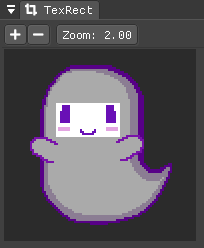

= Documentation
:nofooter:
:toc: left
:toclevels: 3
:icons: font
:favicon:
:experimental:

SpookyGhost is a procedural animation tool for sprites made with the https://ncine.github.io/[nCine].

You can animate many different properties like the size, rotation, position, and color of your sprites, as well as deform their shape.

When you are satisfied with the results you can export the animation as single frames or as one big spritesheet.

SpookyGhost is still at an early stage of development. If you find any issue or bug please report it on: https://encelo.itch.io/spookyghost/community.

'''

== Menus

image::menus.png[Menus]

=== File menu
image::file_menu.png[File Menu]

Selecting menu:File[New] or pressing kbd:[Ctrl+N] will remove all animations, sprites, and textures.

image::open_dialog.png[Open Dialog]
Selecting menu:File[Open] or pressing kbd:[Ctrl+O] will open a dialog window to specify the project file to load.

Selecting menu:File[Open Bundled] will open a list of projects to load.
They are distributed alongside the program as examples.

Selecting menu:File[Save] or pressing kbd:[Ctrl+S] will save the currently opened project.
The menu item is available only if you have opened a project previously or if you have already saved it with a name.

image::saveas_dialog.png[Save as Dialog]
Selecting menu:File[Save as...] will open a dialog window to specify the filename to use for saving.
If the `Allow Overwrite` checkbox is not enabled the program will not save if a file with the same name already exists.

Selecting menu:File[Configuration] will open the configuration window.

Selecting menu:File[Quit] or pressing kbd:[Ctrl+Q] will quit the program.

=== Help menu
image::help_menu.png[Help Menu]

Selecting menu:Help[Documentation] or pressing kbd:[F1] will open this documentation file.

Selecting menu:Help[About] will open the about window with information about the program version.

== Configuration Window

image::configuration_window.png[Configuration window]

The `Configuration` window contains some customizable properties that can be saved and will be used every time the program starts.

The top section allows to change the window size or to choose a fullscreen mode.
You can make the window `Resizable` or not as well as `Apply` your changes immediately or go back to `Current` window settings.

Next you can enable or disable `Vertical Sync`. If you disasble it you can specify a `Frame Limit` to control the number of frames rendered per second or select `0` to switch it off.
To apply the changes in this section you need to save the configuration and restart the program.

You can choose the initial canvas size that will be used when the program starts for the first time as well as the maximum size of the Lua project file.

After that you can choose the name of a project file that will be loaded the first time you start the program and optionally play it right away.

The last two text input widgets will let you choose a path for textures and sprites that will be concatenated if you specify a relative path when loading.

At the very bottom of the window two buttons will `Load` or `Save` the configuration to the `config.lua` file in the same directory as the program executable.

== Main Window
The `Main` window is placed on the left by default. From it, you can access most of the program functionalities.

=== Canvas section

image::canvas.png[Canvas section]

From the Canvas section, the first on top, you can change different options related to your canvas.
The canvas is your working area for animations.

You can change the zoom level, you can change its size and you can change its background color.

TIP: You can change the canvas zoom level by hovering on the Canvas window, pressing the kbd:[Ctrl] key and scrolling the mouse wheel.

To change the canvas size you need to first choose a size preset and then click on the `Apply` button.
You can also select `Custom` and then enter a custom size.

When you change the background color don't forget to also change the alpha opacity or you might not see the color you selected to appear in the canvas.

=== Sprites section
image::sprites1.png[Sprites section 1]

From the Sprites section, just below the Canvas one, you can create your sprites and change their properties.

The first thing to do is loading a texture by writing its name in the `Filename` input text widget and then click the `Load` button.

Once a texture is loaded you will have access to an `Add` button that allows you to create new sprites.

image::sprites2.png[Sprites section 2]

After having created a sprite more options will be available.

You can delete the sprite you just created by clicking the `Remove` button or pressing the kbd:[Delete] key.

If you have created more than one sprite you can change the drawing order between them with the `Move Up` and `Move Down` buttons.

image::sprites3.png[Sprites section 3]

The `Sprite` drop-down menu shows every available sprite and lets you choose one to work with.

You will be able to give it a name, make it invisible, give it a parent sprite, change its position, rotation, scale and anchor point. You will also be able to select a texture rectangle, flip the texture, select a blending type and change its color.

When you set a parent for a sprite its properties will depend upon its parent's properties, the properties of its grandparent and so on. The parent-child sprite relationship is a powerful way to achieve very complex chained transformations.

Selecting a texture rectangle is useful when your texture is a spritesheet and you only want to use a specific area as your sprite.

TIP: You can use the `TexRect` window to help you set up a texture rectangle using the mouse. Enable the `Show Preview` checkbox for the `TexRect` window to appear.

=== Animations section
image::animations.png[Animations section]

The animations section lets you create four different kinds of animation.

image::animation_types.png[Animation types]

Just select a type from the drop-down menu then click the `Add` button.

==== Animation group
image::parallel_group.png[Parallel group]

You can create a `Parallel Group` or a `Sequential Group` as a way to organize together multiple animations. They will be played together or one after another depending on the group type.

You can give a name to an animation group and create sub-animations with the `Add` button.

TIP: An animation group can be composed of animation sub-groups.

You can control the state of an animation group with the `Stop`, `Pause` and `Play` buttons and use the `Remove` one to destroy it together with all contained animations.

==== Property animation
image::property_animation.png[Property animation]

A property animation can animate some properties of a sprite such as:

* Position
* Rotation
* Scale
* Anchor Point
* Opacity
* Color channels

Similarly to an animation group you can change its name at the top of the interface. At the bottom, you can control its state with the `Stop`, `Pause` and `Play` buttons or use the `Remove` one to destroy it.

With the `Sprite` drop-down menu you can choose the sprite whose property you want to change, then you can choose which property with the `Property` drop-down menu just beneath it.

You can change the easing curve of the time parameter between a list of curves like:

* Linear
* Quadratic
* Cubic
* Quartic
* Quintic
* Sine
* Exponential
* Circular

You can then select the `Direction`: `Forward` or `Backward`. And then the `Loop Mode`: `Disabled`, `Rewind` or `Ping Pong`.

You are then presented with two sliders that let you `Shift` and `Scale` the value returned by the curve function.
The function will take the time parameter, a number between 0 and 1, and return another value between 0 and 1.

You can then shift this value and scale it according to your needs. For example, if you want your sprite to move horizontally from 100 to 150 you will need to set `Position X` as your property, then shift the value to 100 and scale it to 50.

Going below there is another block of options. They are related to time: the input parameter to the easing function.

You can change the `Speed` to make the animation slower or faster, and you can change the `Start` and `End` value to affect its range.

The last slider, `Time`, is updated in real-time according to current time value. When the animation is not playing you can directly change it to see how it affects your sprite property. You can also read the current `Value` for the easing curve.

==== Grid animation
image::grid_animation.png[Grid animation]

A grid animation deforms your sprite shape to achieve some special effects.

The interface is identical to the <<Property animation>> one with some small but important differences.

Instead of being able to choose which sprite property to affect you will be able to choose a grid `Function`.

There are five different grid functions to choose from:

* Wave X
* Wave Y
* Skew X
* Skew Y
* Zoom

TIP: Functions can be combined by adding multiple grid animations that affect the same sprite. For example, you can add a `Wave X` and a `Wave Y` function to make the sprite wave in both directions.

Depending on which function you choose a different list of parameters will appear. They will allow you to tweak the results of the grid deformation.

Some grid functions have an anchor related parameter, it can be edited with the mouse in the <<Canvas window>>.

=== Render section
image::render.png[Render section]

When you are happy with the results of your animation it is time to export it.

You can choose a prefix for the files that are going to be created. Just specify a path and a filename without the extension.

You can then choose to resize the canvas before saving its contents and then choose how many frames to generate per second.

Based on the `FPS` value you will then be able to change the number of frames produces either by setting its number directly or by choosing a duration.

When you are ready you can either press `Save Frames` and have all the frames saved as distinct PNG images or press `Save Spritesheet` and save all frames in a single big PNG image.

image::render_progress.png[Render progress]

While the operation is in progress you can click the `Cancel` button or press the kbd:[Esc] key to cancel it.

How big a single frame and the spritesheet are going to be can be read in the `Frame size` and `Spritesheet size` text widgets.

== TexRect window

In the <<Sprites section>> you can find a `Show Preview` checkbox. If it is enabled the `TexRect` window will be available.

This window shows you which part of the texture will be used by the sprite for rendering.

You can use the mouse to select a rectangular region and fine-tune its size in the <<Sprites section>> of the interface.

== Canvas window
image::canvas_window.png[Canvas window]

The `Canvas` window is where all animations will be played.

You can change the zoom level in the <<Canvas section>> or by pressing kbd:[Ctrl] and using the mouse wheel.

TIP: Pressing the arrow keys will move the sprite in one pixel increments to allow for precise presitioning.

You can also change the sprite anchor point by pressing kbd:[Shift] and the left mouse button and dragging the red point around the red rectangle.

If you instead press kbd:[Ctrl] and the left mouse button a blue point and a blue rectangle will appear to allow you to set the grid anchor point used by <<Grid animation>>s.

You can also press kbd:[Shift+Ctrl] together and use the mouse to set both the sprite and the grid anchor points in one go.

== Status bar
Underneath the <<TexRect window>> and the <<Canvas window>> there is a status bar. It will show error and information messages as well as the mouse coordinates during some operations.
