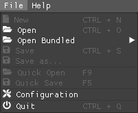
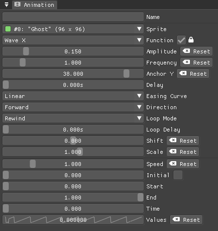
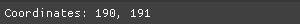

= Documentation
:nofooter:
:toc: left
:toclevels: 3
:icons: font
:favicon:
:experimental:

SpookyGhost is a procedural animation tool for sprites made with the https://ncine.github.io/[nCine].

You can animate many different properties like the size, rotation, position, and color of your sprites, as well as deform their shape.

When you are satisfied with the results you can export the animation as single frames or as one big spritesheet.

SpookyGhost is still at an early stage of development. If you find any issue or bug please report it on: https://encelo.itch.io/spookyghost/community.

'''

== ImGui interface

SpookyGhost interface is made with https://github.com/ocornut/imgui[ImGui]. You can use most of ImGui user interaction capabilities while using the program.

You can drag windows around and anchor them into any corner, change the split space between them or tab them one next to another.

If you press kbd:[Ctrl] while clicking on a slider or drag box you can input value as text.
Another interesting functionality is the ability to modify the speed of change of drag boxes by pressing kbd:[Shift] or kbd:[Alt]. With the first key, the change will be faster while with the second one it will be slower. Try it now while changing a texture rectangle in the <<Sprite window>>.

You can use the usual kbd:[Ctrl + X], kbd:[Ctrl + C], and kbd:[Ctrl + V] to cut, copy, and paste text in a text input widget.

You can drag and drop colors around, for example, the background color of the <<Canvas window>> onto the sprite color in the <<Sprite window>>.

== Menus

=== File menu

Selecting menu:File[New] or pressing kbd:[Ctrl+N] will remove all animations, sprites, and textures.

image::open_dialog.png[Open Dialog]
Selecting menu:File[Open] or pressing kbd:[Ctrl+O] will open a dialog window to specify the project file to load.

Selecting menu:File[Open Bundled] will open a list of projects to load.
They are distributed alongside the program as examples.

Selecting menu:File[Save] or pressing kbd:[Ctrl+S] will save the currently opened project.
The menu item is available only if you have opened a project previously or if you have already saved it with a name.

image::saveas_dialog.png[Save as Dialog]
Selecting menu:File[Save as...] will open a dialog window to specify the filename to use for saving.
If the `Allow Overwrite` checkbox is not enabled the program will not save if a file with the same name exists already.

Selecting menu:File[Configuration] will open the configuration window.

Selecting menu:File[Quit] or pressing kbd:[Ctrl+Q] will quit the program.

=== Help menu
image::help_menu.png[Help Menu]

Selecting menu:Help[Documentation] or pressing kbd:[F1] will open this documentation file.

Selecting menu:Help[About] will open the about window with information about the program version.

== Configuration window

image::configuration_window.png[Configuration window]

The `Configuration` window contains some customizable properties that will be used every time the program starts.

The top section allows you to change the window size or to choose a fullscreen mode.
You can make the window `Resizable` or not as well as `Apply` your changes immediately or go back to `Current` window settings.

Next, you can enable or disable `Vertical Sync`. If you disable it you can specify a `Frame Limit` to control the number of frames rendered per second or select `0` to switch it off.
To apply the changes in this section you need to save the configuration and restart the program.

You can choose the initial canvas size that will be used when the program starts for the first time as well as the maximum size of the Lua project file.

After that, you can choose the name of a project file that will be loaded the first time you start the program and optionally play it right away.

The last two text input widgets will let you choose a path for textures and sprites that will be concatenated if you specify a relative path when loading.

Upon closing the window the configuration will be saved in the `config.lua` file in the same directory as the program executable.

== Textures window

image::textures_window.png[Textures window]

One of the tabs in the top left corner of the interface is the `Textures` window.

Before being able to create any sprite you need to load at least one texture from here. Just write the path of the file, either absolute or relative to the textures path you chose in the <<Configuration window>>, and press the `Load` button.

You can delete the selected texture by clicking the `Remove` button or pressing the kbd:[Delete] key while the cursor is over this window.

When you create a new sprite it will use the texture you selected in this window.

== Sprites window

image::sprites_window.png[Sprites window]

Next to the <<Textures window>> tab, you will find the `Sprites` window.
You can use it to `Add` and `Remove` sprites or to move an existing sprite to a higher or lower drawing layer.

You can also delete the selected sprite by pressing the kbd:[Delete] key while the cursor is over this window.

At the beginning of each entry, there is a checkbox you can use to make the sprite visible or not.

TIP: The texture icon at the end of an entry indicates that the sprite is using the currently selected texture.

== Animations window

image::animations_window.png[Animations window]

In the lower part of the left side of the interface, you will find the `Animations` window.

You can use it to `Add` and `Remove` animations and to change their state with the `Stop`, `Pause` and `Play` buttons.

You can delete the selected animation also by pressing the kbd:[Delete] key while the cursor is over this window.

You can find an icon about the current animation state at the end of an animation entry.

TIP: Pressing kbd:[Space] will toggle the animation state between playing and paused.

image::animation_types.png[Animation types]

Before pressing the `Add` button choose one of the four animation types.

The `Parallel Group` and `Sequential Group` help to organize together multiple animations. They will be played together or one after another depending on the group type. An animation group can also be composed of sub-groups.

TIP: The sprite icon at the end of an entry indicates that the animation is assigned to the currently selected sprite. When you select a different animation its assigned sprite will be automatically selected.

NOTE: The `Sequential Group` type is currently disabled until some related bugs are fixed.

== Sprite window

image::sprite_window.png[Sprite window]

On the top part of the right side of the interface, you will find the `Sprite` window.

You can change all the properties of the selected sprite from here.

You will be able to give it a name, give it a parent sprite, change its position, rotation, scale and anchor point. You will also be able to select a texture rectangle, flip the texture, select a blending type and change its color.

When you set a parent for a sprite its properties will depend upon its parent's properties, the properties of its grandparent and so on. The parent-child sprite relationship is a powerful way to achieve very complex chained transformations.

Selecting a texture rectangle is useful when your texture is a spritesheet and you only want to use a specific area as your sprite.

TIP: You can use the <<TexRect window>> to help you set up a texture rectangle using the mouse.

== Animation window

Next to the <<Sprite window>> tab, you will find the `Animation` window, where you can change all the properties of the selected animation.

For every type of animation, including a group one, you will be able to change its name at the top of the interface.

=== Property animation window

image::property_animation_window.png[Property animation window]

With the `Sprite` drop-down menu you can choose the sprite whose property you want to change.

Just beneath you can choose which property to animate:

* Position
* Rotation
* Scale
* Anchor Point
* Opacity
* Color channels

You can change the easing curve of the time parameter between a list of curves like:

* Linear
* Quadratic
* Cubic
* Quartic
* Quintic
* Sine
* Exponential
* Circular

You can then select the `Direction`: `Forward` or `Backward`. And then the `Loop Mode`: `Disabled`, `Rewind` or `Ping Pong`.

You are then presented with two sliders that let you `Shift` and `Scale` the value returned by the curve function.
The function will take the time parameter, a number between 0 and 1, and return another value between 0 and 1.

You can then shift this value and scale it according to your needs. For example, if you want your sprite to move horizontally from 100 to 150 you will need to set `Position X` as your property, then shift the value to 100 and scale it to 50.

Going below there is another block of options. They are related to time: the input parameter to the easing function.

You can change the `Speed` to make the animation slower or faster, and you can change the `Start` and `End` value to affect its range.

The last slider, `Time`, is updated in real-time according to current time value. When the animation is not playing you can directly change it to see how it affects your sprite property.

You can also read the current value for the easing curve and have a look at a graphical plot of recent `Values`.

=== Grid animation window

A grid animation deforms your sprite shape to achieve some special effects.

The interface is identical to the <<Property animation>> one with some small but important differences.

Instead of being able to choose which sprite property to affect you will be able to choose a grid `Function`.

There are five different grid functions to choose from:

* Wave X
* Wave Y
* Skew X
* Skew Y
* Zoom

TIP: Functions can be combined by adding multiple grid animations that affect the same sprite. For example, you can add a `Wave X` and a `Wave Y` function to make the sprite wave in both directions.

Depending on which function you choose a different list of parameters will appear. They will allow you to tweak the results of the grid deformation.

Some grid functions have an anchor related parameter, it can be edited with the mouse in the <<Canvas window>>.

== Render window
image::render_window.png[Render window]

When you are happy with the results of your animation it is time to export it.

You can choose a prefix for the files that are going to be created. Just specify a path and a filename without the extension.

You can then choose to resize the canvas before saving its contents and then choose how many frames to generate per second.

Based on the `FPS` value you will then be able to change the number of frames produces either by setting its number directly or by choosing a duration.

When you are ready you can either press `Save Frames` and have all the frames saved as distinct PNG images or press `Save Spritesheet` and save all frames in a single big PNG image.

image::render_progress.png[Render progress]

While the operation is in progress you can click the `Cancel` button or press the kbd:[Esc] key to cancel it.

How big a single frame and the spritesheet are going to be can be read in the `Frame size` and `Spritesheet size` text widgets.

== Canvas window

image::canvas_window.png[Canvas window]

At the center of the interface lies the `Canvas` window. The canvas is your working area for animations.

At the top of this window, you will find some controls to change the zoom level, its size, and its background color.

TIP: You can change the canvas zoom level by hovering on the Canvas window, pressing the kbd:[Ctrl] key and scrolling the mouse wheel.

When you change the background color don't forget to change the alpha opacity or you might not see the color you selected in the canvas.

When the `Borders` checkbox is enabled a colored rectangle will show the current size of the canvas.

TIP: Pressing the arrow keys while the cursor is on the canvas will move the selected sprite in one pixel increments for precise positioning.

image::canvas_window_anchor.png[Canvas window anchor]

You can also change the sprite anchor point by pressing kbd:[Shift] and the left mouse button and dragging the red point around the red rectangle.

If you instead press kbd:[Ctrl] and the left mouse button a blue point and a blue rectangle will appear to allow you to set the grid anchor point used by Grid animations.

You can also press kbd:[Shift+Ctrl] together and use the mouse to set both the sprite and the grid anchor points in one go.

== TexRect window
image::texrect_window.png[TexRect window]

The `TexRect` window is available when at least one sprite has been created.
It shows you which part of the texture will be used by the sprite for rendering.

You can use the mouse to select a rectangular region and fine-tune its size in the <<Sprites section>> of the interface.

== Status bar

At the bottom of the interface, you will find the status bar. It will show error and information messages as well as the mouse coordinates during some operations.
