= Documentation
:nofooter:
:toc: left
:toclevels: 3
:icons: font
:favicon:
:experimental:
:source-highlighter: rouge

SpookyGhost is a procedural animation tool for sprites made with the https://ncine.github.io/[nCine].

You can animate many different properties like the size, rotation, position, and color of your sprites, as well as deform their shape.

You can also use the Lua progamming language to write scripts for custom-made animations.

When you are satisfied with the results you can export the animation as single frames or as one big sprite sheet.

If you find a bug in the program please open an https://github.com/SpookyGhost2D/SpookyGhost/issues[issue] on GitHub or report it on the Itch.io https://encelo.itch.io/spookyghost/community[community].

'''

== Interface

=== ImGui interaction

SpookyGhost interface is made with https://github.com/ocornut/imgui[ImGui]. You can use most of ImGui's user interaction capabilities while using the program.

You can drag windows around and anchor them into any corner, change the split space between them or tab them one next to another.

If you press kbd:[Ctrl] while clicking on a slider or a drag box you can input the value with the keyboard.
Another interesting functionality is the ability to modify the speed of change of drag boxes by pressing kbd:[Shift] or kbd:[Alt]. With the first key, the change will be faster while with the second one it will be slower. Try it now while changing a texture rectangle in the <<Sprite window>>.

You can use the usual kbd:[Ctrl + X], kbd:[Ctrl + C], and kbd:[Ctrl + V] to cut, copy, and paste text in a text input widget.

You can drag and drop colors around, for example, the background color of the <<Canvas window>> onto the sprite color in the <<Sprite window>>.

=== Menus

==== File menu
image::file_menu.png[File Menu]

Selecting menu:File[New] or pressing kbd:[Ctrl + N] will remove all animations, sprites, and textures.

Selecting menu:File[Open] or pressing kbd:[Ctrl + O] will open the <<File dialog>> window to specify the project file to load. The file dialog will only show files with the `lua` extension.

Selecting menu:File[Open Bundled] will open a list of projects to load.
They are distributed alongside the program as examples.

Selecting menu:File[Save] or pressing kbd:[Ctrl + S] will save the currently opened project.
The menu item is available only if you have opened a project previously or if you have already saved it with a name.

Selecting menu:File[Save as...] will open the <<File dialog>> window to specify the filename to use for saving.
If the `Allow Overwrite` checkbox is not enabled the program will not save if a file with the same name exists already.

Selecting menu:File[Quick Open] or pressing kbd:[F9] will open the last file saved with the `Quick Save` function. Keep in mind that the operation will be performed without asking the user to first save the current project.

Selecting menu:File[Quick Save] or pressing kbd:[F5] will save a project file using a combination of the date and time as the name.
It can be a way to save multiple versions of your project while working on it.

Selecting menu:File[Configuration] will open the <<Configuration window>>.

Selecting menu:File[Quit] or pressing kbd:[Ctrl + Q] will open a modal window asking if you want to quit the program.

==== Help menu
image::help_menu.png[Help Menu]

Selecting menu:Help[Documentation] or pressing kbd:[F1] will open this documentation file.

Selecting menu:Help[Tips] will open the <<Tips window>>.

Selecting menu:Help[About] will open the about window with information about the program version.

=== File dialog

When you have to browse your filesystem to load or save files or choose directories, the program will present you with a `file dialog` window.

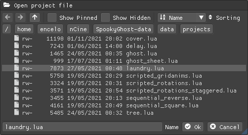

The file dialog will show you all the entries inside a directory together with their types (file or directories), access permissions, sizes, and last modification dates. It will also color executables with a shade of green and filter files by extension if needed, for example when loading a project file or a texture.

image::file_dialog_save.png[Save a project file]

When saving a project file the file dialog will be slightly different. It will have an btn:[Overwrite] checkbox to bypass the check for an existing file and it will allow you to write in the text input widget and choose a name for the new file.

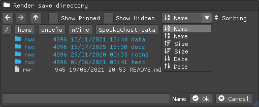

When deciding the destination directory for rendered frames the file dialog will allow directories to be selected.

All kinds of file dialogs have a set of checkboxes to show or hide file permissions, sizes, and dates plus a checkbox that when enabled will show hidden files or directories. As you can see in the last screenshot there is also a drop-down menu to select the entries sorting based on names, sizes, or dates.

=== Tips window

image::tips_window.png[Tips window]

The `Tips` window will show you a random tip about the program every time you start it.

You can read the previous or the next tip with the btn:[Prev] and btn:[Next] buttons. You can also navigate them with the left or right arrow key while the cursor is over this window.

There is also a checkbox to enable or disable the default behavior of automatically showing this window on start.
The same checkbox is also present in the <<Configuration window>>.

=== Configuration window

image::configuration_window.png[Configuration window]

The `Configuration` window contains some customizable properties that will be used every time the program starts.

The top section allows you to change the window size or to choose a fullscreen mode.
You can make the window btn:[Resizable] or not as well as btn:[Apply] your changes immediately or go back to btn:[Current] window settings.

Next, you can enable or disable btn:[Vertical Sync]. If you disable it you can specify a `Frame Limit` to control the number of frames rendered per second or select `0` to switch it off.
To apply the changes in this section you need to save the configuration and restart the program.

You can choose the initial canvas size that will be used when the program starts for the first time.

After that, you can choose the name of a project file that will be loaded the first time you start the program and optionally play it right away.

The three text input widgets will let you choose a path for textures, sprites, and scripts that will be concatenated if you specify a relative path when loading.

With the last checkbox you can enable or disable the automatic showing of the <<Tips window>> when the program starts up.

Upon closing the window the configuration will be saved in the `config.lua` file in the same directory as the program executable.

=== Textures window

image::textures_window.png[Textures window]

One of the tabs in the top left corner of the interface is the `Textures` window.

Before being able to create any sprite you need to load at least one texture from here. Clicking the btn:[Load] button will open the <<File dialog>> window. The file dialog will only show files with the `png` extension.

You can delete the selected texture by clicking the btn:[Remove] button or pressing the kbd:[Delete] key while the cursor is over this window.

You can load a different file for your texture using the btn:[Reload] button. Your sprites and your animations will update with the new image.

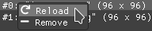

Some of those actions are also available in the context menu that appears when you right-click on a texture.

When you create a new sprite it will use the texture you selected in this window.

[TIP]
====
image::tooltip_textures.png[Tooltip image textures]
If you hover with the mouse on a texture a small preview will appear as a tooltip.
====

=== Sprites window

image::sprites_window.png[Sprites window]

Next to the <<Textures window>> tab, you will find the `Sprites` window.
You can use it to btn:[Add] and btn:[Remove] sprites or to move an existing sprite to a higher or lower drawing layer.

With the btn:[Add Group] button you can create sprite groups, use them to organize your sprites or other groups.

Next to a sprite or a group there is a color square that will help you locate the corresponding animations in the <<Animations window>>.
You can click on any of those squares to pick a different color. A sprite inside a group will use its parent group color but it will revert to the original one once it is taken out.

You can also delete the selected sprite or group by pressing the kbd:[Delete] key while the cursor is over this window.

With the btn:[Clone] button, it is possible to create a copy of the selected sprite. The animations assigned to the original sprite will be cloned as well. If the selected sprite has children sprites they will be cloned too.
If you select a group and clone it then every contained sprites will be clones, including their animations and children sprites.

image::context_menu_sprites.png[Context menu for sprites]

Some of those actions are also available in the context menu that appears when you right-click on a sprite.

At the beginning of each entry, there is a checkbox you can use to make the sprite visible or not.

The list order is reversed so that the top sprite is also the one that will be rendered on top of the others.

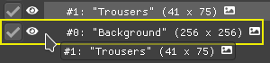
You can reorder the list with the btn:[Move Up] and btn:[Move Down] buttons or by drag and drop.
You can also move them with the up or down arrow key while the cursor is over this window.

[TIP]
====
image::edit_sprite_name.png[Edit Sprite Name]
You can quickly edit a sprite name by clicking on a sprite while pressing kbd:[CTRL].
====

[TIP]
====

If you hover with the mouse on a sprite a small preview will appear as a tooltip.
====

TIP: The texture icon at the end of an entry indicates that the sprite is using the currently selected texture.

=== Scripts window

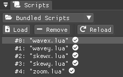

Next to the <<Sprites window>> tab, you will find the `Scripts` window.

At the top, there is a combo box with a list of scripts that are distributed with the program: use it to easily load the default scripts.

Below you will find some buttons that you can use to btn:[Load] and btn:[Remove] Lua scripts as well as btn:[Reload] them when they have changed on disk.

You can also delete the selected script by pressing the kbd:[Delete] key while the cursor is over this window.

Some of those actions are also available in the context menu that appears when you right-click on a script.

At the end of each entry, you will find either a checkmark or a cross icon.
The first one tells you that there are no syntax errors and the script can run while the second indicates the opposite.

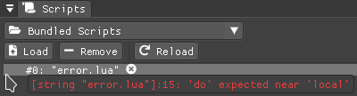

In case of errors that prevent a script from running, you can hover on the entry to show a tooltip with the error message.

TIP: You can reload a script also by pressing kbd:[CTRL + R].

=== Animations window

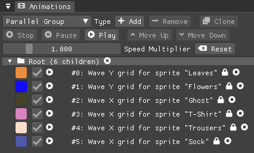

In the lower part of the left side of the interface, you will find the `Animations` window.

You can use it to btn:[Add] and btn:[Remove] animations and to change their state with the btn:[Stop], btn:[Pause], and btn:[Play] buttons.

Below those buttons there is slider to control the global speed multiplier, it can be used to change the speed of all animations at once.

You can delete the selected animation also by pressing the kbd:[Delete] key while the cursor is over this window.

With the btn:[Clone] button, it is possible to create a copy of the selected animation or animation group.

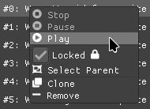

Some of those actions are also available in the context menu that appears when you right-click on an animation.

At the beginning of each entry, there is a color square that matches the color of the assigned sprite or its parent group.

Next to it there is a checkbox you can use to make the animation enabled or not. A disabled animation will not be played by the parent group that contains it.

You can find an icon about the current animation state at the end of an animation entry.

[TIP]
====
image::edit_animation_name.png[Edit Animation Name]
You can quickly edit an animation name by clicking on a animation while pressing kbd:[CTRL].
====

TIP: Pressing kbd:[Space] when hovering on the Canvas window will toggle the animation state between playing and paused.

image::animation_types.png[Animation types]

Before pressing the btn:[Add] button, choose one of the four animation types.

==== Animation groups

The `Parallel Group` and `Sequential Group` help to organize together multiple animations. They will be played together or one after another depending on the group type. An animation group can also be composed of sub-groups.

image::sequential_animation_window.png[Sequential animation window]

Their window has the same `Direction` and `Loop Mode` options as the non-group animation types.

Like all animation types, they have a `Delay` value that allows setting a delay in seconds between the time the animation goes into the playing state and the animation start.

They also have a `Loop Delay` value that allows setting a delay in seconds between each loop reset.

At the bottom there is a list of sprites with an btn:[Apply] button that overrides the sprite used by every contained animation. It comes in handy when you clone a group and want to apply the same animations to a different sprite.

IMPORTANT: Animations inside a Sequential Group will not be able to loop.

[TIP]
====
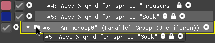
You can reorder the child order with the btn:[Move Up] and btn:[Move Down] buttons or change the parent and children relationships by drag and drop.
You can also move them with the up or down arrow key while the cursor is over this window.
====

TIP: The sprite icon at the end of an entry indicates that the animation is assigned to the currently selected sprite. When you select a different animation its assigned sprite will be automatically selected.

=== Sprite window

image::sprite_window.png[Sprite window]

On the top part of the right side of the interface, you will find the `Sprite` window.

You can change all the properties of the selected sprite from here.

You will be able to give it a name, change its texture, set a parent sprite, change its position, rotation, scale, and anchor point. You will also be able to select a texture rectangle, flip the texture, select a blending type separately for the RGB and alpha channels and change its color.

When you set a parent for a sprite its properties will depend upon its parent's properties, the properties of its grandparent, and so on. The parent-child sprite relationship is a powerful way to achieve very complex chained transformations.

Selecting a texture rectangle is useful when your texture is a sprite sheet and you only want to use a specific area as your sprite.

TIP: You can use the <<TexRect window>> to help you set up a texture rectangle using the mouse.

=== Animation window

Next to the <<Sprite window>> tab, you will find the `Animation` window, where you can change all the properties of the selected animation.

For every type of animation, including a group one, you will be able to change its name at the top of the interface.

==== Property animation window

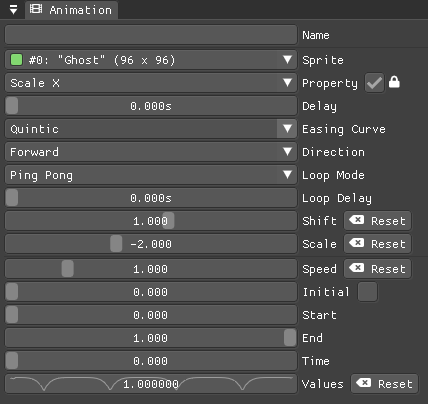

With the `Sprite` drop-down menu, you can choose the sprite whose property you want to change.

Just beneath you can choose which property to animate:

* Position
* Rotation
* Scale
* Anchor Point
* Opacity
* Color channels

Next to the property name, there is a checkbox with a lock icon. When it is enabled the curve value is applied to the property even if the animation is currently stopped or paused.
This option is useful to show a preview of how the property animation is affecting the sprite given the current curve value.

Like all animation types, it has a `Delay` value that allows setting a delay in seconds between the time the animation goes into the playing state and the animation start.

You can change the easing curve of the time parameter between a list of curves like:

* Linear
* Quadratic
* Cubic
* Quartic
* Quintic
* Sine
* Exponential
* Circular

You can then select the `Direction`: `Forward` or `Backward`. And then the `Loop Mode`: `Disabled`, `Rewind`, or `Ping Pong`.

Like all loopable animations, there is also a `Loop Delay` value that allows setting a delay in seconds between each loop reset.

You are then presented with two sliders that let you `Shift` and `Scale` the value returned by the curve function.
The function will take the time parameter, a number between 0 and 1, and return another value between 0 and 1.

You can then shift this value and scale it according to your needs. For example, if you want your sprite to move horizontally from 100 to 150 you will need to set `Position X` as your property, then shift the value to 100 and scale it to 50.

Going below there is another block of options. They are related to time: the input parameter to the easing function.

You can change the `Speed` to make the animation slower or faster, and you can change the `Start` and `End` values to affect its range.

The `Initial` value is very similar to the `Start` and `End` values but, instead of defining a range, it allows to specify an initial value within the range. It is very useful, for example, when you want to reuse the same animation and the same range multiple times on different sprites but you want them to play staggered.

The last slider, `Time`, is updated in real-time according to the current time value. When the animation is not playing you can directly change it to see how it affects your sprite property.

You can also read the current value for the easing curve and have a look at a graphical plot of recent `Values`.

==== Grid animation window

image::grid_animation_window.png[Grid animation window]

A grid animation deforms your sprite shape to achieve some special effects.

The interface is identical to the <<Property animation window>> one with some small but important differences.

Instead of being able to choose which sprite property to affect you will be able to choose a grid `Function`.

There are five different grid functions to choose from:

* Wave X
* Wave Y
* Skew X
* Skew Y
* Zoom

Next to the grid function name, there is a checkbox with a lock icon. When it is enabled the curve value is applied to the function even if the animation is currently stopped or paused.
This option is useful to show a preview of how the grid animation is affecting the sprite given the current curve value.

TIP: Functions can be combined by adding multiple grid animations that affect the same sprite. For example, you can add a `Wave X` and a `Wave Y` function to make the sprite wave in both directions.

Depending on which function you choose a different list of parameters will appear. They will allow you to tweak the results of the grid deformation.

Some grid functions have an anchor related parameter, it can be edited with the mouse in the <<Canvas window>>.

==== Script animation window

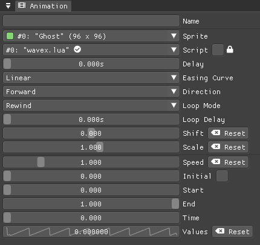

A script animation runs a particular Lua script to perform a custom animation.

The interface is very similar to a <<Property animation window>> or a <<Grid animation window>>.

You can choose the sprite to animate as well as the script you want to use among the ones currently loaded.

Similarly to the <<Scripts window>>, a checkmark or a cross icon will tell you if a script can run.

Next to the script name, there is a checkbox with a lock icon. When it is enabled the script will be invoked even if the animation is currently stopped or paused.
This option is useful to show a preview of how the script animation is affecting the sprite given the current curve value.

=== Render window
image::render_window.png[Render window]

When you are happy with the results of your animation it is time to export it.

Clicking the button on top will open the <<File dialog>> window to choose a destination directory.

You can then choose a prefix for the files that are going to be created. Just specify a filename without the extension.

You can then choose to resize the canvas before saving its contents and then choose how many frames to generate per second.
The resize combo box will also show the size of a resized frame.

Based on the `FPS` value you will then be able to change the number of frames produced either by setting its number directly or by choosing a duration.

The `Layout` combo box will let you specify how the frames will be arranged inside a spritesheet. You can choose between a rectangle arrangement that prioritizes the horizontal or vertical dimension (`HRectangle` and `VRectangle`), a horizontal or vertical strip (`HStrip` and `VStrip`), or specify `Custom` values for the two dimensions.

When you are ready you can either press `Save Frames` and have all the frames saved as distinct PNG images or press `Save Spritesheet` and save all frames in a single big PNG image.

image::render_progress.png[Render progress]

While the operation is in progress you can click the btn:[Cancel] button or press the kbd:[Esc] key to cancel it.

When the saving operation is completed the window and the system taskbar will flash to notify its success.

You can read how big a single frame and the sprite sheet are going to be in the `Frame size` and `Spritesheet size` text widgets.

=== Canvas window

image::canvas_window.png[Canvas window]

At the center of the interface lies the `Canvas` window. The canvas is your working area for animations.

If you press kbd:[Alt] you can drag the selected sprite around by clicking anywhere in the canvas.

At the top of this window, you will find some controls to change the zoom level, its size, and its background color.

TIP: You can change the canvas zoom level by hovering on the Canvas window, pressing the kbd:[Ctrl] key, and scrolling the mouse wheel.

When you change the background color don't forget to change the alpha opacity or you might not see the color you selected in the canvas.

When the btn:[Borders] checkbox is enabled a colored rectangle will show the current size of the canvas.

TIP: Pressing the arrow keys while the cursor is on the Canvas window will move the selected sprite in one-pixel increments for precise positioning.

image::canvas_window_anchor.png[Canvas window anchor]

You can also change the sprite anchor point by pressing kbd:[Shift] and the left mouse button and dragging the red point around the red rectangle.

If you instead press kbd:[Ctrl] and the left mouse button a blue point and a blue rectangle will appear to allow you to set the grid anchor point used by Grid animations.

You can also press kbd:[Shift+Ctrl] together and use the mouse to set both the sprite and the grid anchor points in one go.

=== TexRect window
image::texrect_window.png[TexRect window]

The `TexRect` window shows you which part of the texture will be used by the sprite for rendering.

You can use the mouse to select a rectangular region and fine-tune its size in the <<Sprites section>> of the interface.

If you press kbd:[Alt] and click inside the rectangle, you can drag it around by moving the mouse.

If you press kbd:[Shift] and click inside the rectangle, you can resize it by moving the mouse. If you are close to a corner you will be able to resize the rectangle by moving that corner. If you are close to a side, but not to a specific corner, you will be able to resize the rectangle by moving that side.

=== Status bar

image::status_bar.png[Status bar]

At the bottom of the interface, you will find the status bar. It will show error and information messages as well as the mouse coordinates during some operations.

=== Bundled projects files

The program comes with some bundled project files to show its features and potential.

[discrete]
==== ghost.lua, laundry.lua, tree.lua
Those three files are the classic projects distributed since the first versions of the program. They show what is visually and artistically achievable by using very few and simple animations.

[discrete]
==== delay.lua
The project uses some very simple property animations that, together with different delay values, can achieve an interesting result.

[discrete]
==== ghost_sheet.lua
The project uses the `texrect.lua` script to modify the texture rectangle and animate using a sprite sheet.

[discrete]
==== scripted_gridanims.lua
The project uses the `skewx.lua`, `skewy.lua`, `wavex.lua`, `wavey.lua`, and `zoom.lua` scripts to show how a Lua script can replicate the same functions of a grid animation, albeit consuming a bit more CPU power.

[discrete]
==== scripted_rotations.lua
The project uses the `circle.lua` script to show some rotating ghost sprites.

[discrete]
==== scripted_rotations_staggered.lua
The project is very similar to `scripted_rotations.lua` and it also uses the `circle.lua` script. The difference here is the use of different initial values to create out-of-phase rotations.

[discrete]
==== sequential_square.lua
The project uses two sequential animation groups to move a sprite along a path shaped as a square while also using some grid animations to perform a zoom at the same time.

[discrete]
==== sequential_reverse.lua
The project has a long sequential animation group that can perfectly loop by automatically change the direction of the property animations it contains.

[discrete]
==== cover.lua
The project animates each letter of the SpookyGhost logo differently and it is used for the Itch.io GIF cover.

include::lua_animation_api.adoc[]
include::changelog.adoc[]
